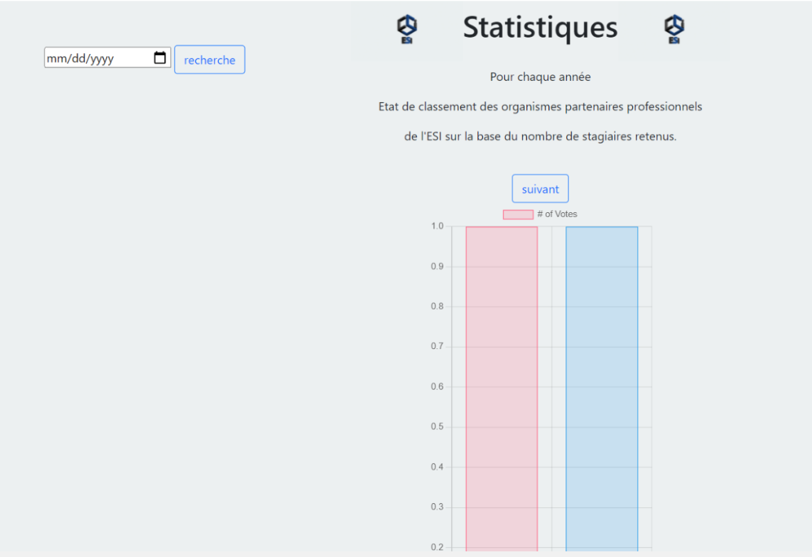

# Internship Management for a Higher Education Institution 🎓

It consists in a web application for managing internships at Universities, helping administrators gain better visibility over the types of internships available at the school. Our application allows for the generation of various useful statistics to support decision-making, as well as i provide users with easily accessible, up-to-date, and reliable information.


## Installation 🛠️

Prerequisite:
- Django

```bash
  env/scripts/activate
```
then 
```bash
python manage.py runserver
```
## Usage/Examples 

<p align="center">
  
</p>

The application provides various management functions, including:

- **Internships**, which contains:
  - Types of internships
  - Registrations

- **Management of host organizations**

- **Management of supervisors** (employees from various organizations)

- **Management of mentors** (teachers from ESI)

- **Intern groups & interns**, which includes:
  - Managing interns who are ESI students
  - Managing intern groups

  <p align="center">
  
</p>


- **Statistics & Reports**

<p align="center">
  
</p>

## License 📜

[MIT](https://choosealicense.com/licenses/mit/)
